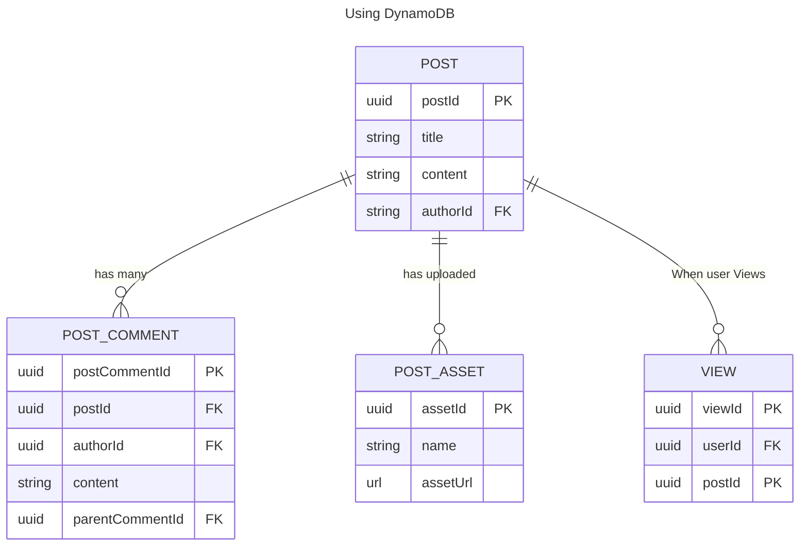
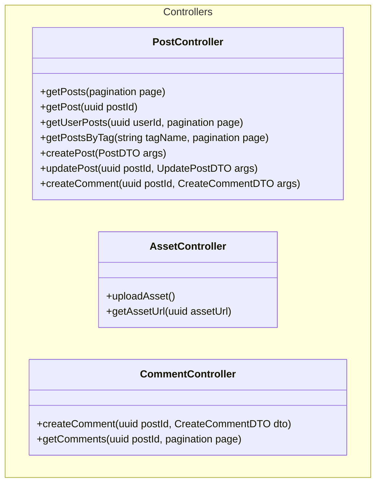

# Serverless Blogging Platform

GOAL: To create a blogging platform to be fully serverless, all code available in github

## Stories

- As a User I must be able to login using my google account
- As a User I must be able to login using my facebook account
- As a User I must be able to login using my x account
- As a User I must be able to post blogs
- As a User I must be able to upload image in my blogs
- As a User I must be able to comment on other people's blogs and my blogs
- As a User I must be able to comment images on other people's blogs
- As a User I must be able to see my previous works
- As a User I must be able to view other users blogs
- As a User or a Guest, when I visit the page, I should get recommendations on what to read
- As a User or a Guest, I should get the hottest recommendations, and recommendations based on undiscovered writers
- As a User I should be able to put tags on my blogposts

## Technical

- Uses AWS Cognito for user logins
- ReactJS + .NET Serverless backend, wherein ReactJS is uploaded in S3
- Database is in DynamoDB
- Uses AWS DevOps stuff )Will be done when I'm a devops pro)
- Frontend will use tailwind, will be very basic in it's design

## Data Model

